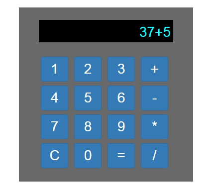

## [JavaScript In Action Project - Build A Calculator](https://www.udemy.com/javascript-in-action-learn-javascript-projects/)

In this tutorial, we learn how to build a simple calculator with JavaScript.

[View demo site here.](https://webdevtuts.github.io/javascript_in_action_calculator/)

